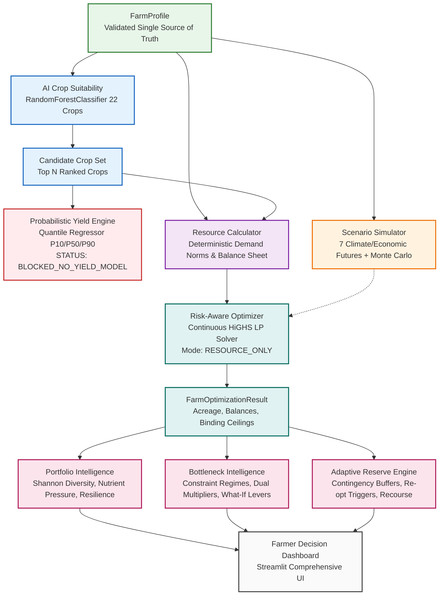

# FarmTwin — Comprehensive Project Architecture Specification

## 1. Executive Summary

**FarmTwin** is a risk-aware, adaptive agricultural decision engine designed to bridge the gap between empirical agro-ecological science, multi-future climate stress testing, and mathematical resource optimization. Unlike traditional agricultural recommender systems that operate deterministically or rely on opaque heuristics, FarmTwin maintains probabilistic spreads, enforces physical resource conservation, strictly gates unvalidated economic models, and provides plain-language explanations.

---

## 2. Core Architectural Principles

1. **Strict Data Honesty & Model Gating**:
   * Machine learning models are only activated when supported by validated, representative empirical training data.
   * If authentic yield records are unavailable, economic revenue/profit predictions and CVaR calculations remain strictly gated (`BLOCKED_NO_YIELD_MODEL`), preventing fabricated financial figures from masquerading as intelligence.
2. **Immutable Farm Profile Data Contract**:
   * All modules consume a single source of truth: [`FarmProfile`](engine/profile.py), validated using Pydantic V2 with strict type coercion and unit normalization (hectares, liters, kg/ha, INR).
   * Downstream engines treat the profile as strictly read-only, ensuring idempotent and pure functional execution.
3. **Decoupled 10-Phase Pipeline**:
   * Each operational layer possesses single responsibility, clear upstream inputs, and structured downstream outputs.
   * The pipeline transitions progressively from input validation, classification, stress simulation, deterministic accounting, and mathematical programming, through to diagnostic portfolio, bottleneck, and adaptive reserve intelligence.
4. **Explainability by Design**:
   * Complex mathematical programming outputs, dual multipliers, diversity indices, and stability ratios are translated into plain-language summaries tailored for agricultural practitioners and extension workers.

---

## 3. End-to-End Pipeline Architecture

---

## 4. Layer-by-Layer Architectural Decomposition

### Phase 1 & 2: Data Ingestion & Input Validation
* **Module**: `engine/profile.py`
* **Contract**: `FarmProfile` Pydantic model.
* **Responsibilities**:
  * Ingests operational land, soil chemistry ($N, P, K, pH$), observed weather (temperature, humidity, rainfall), irrigation water inventory, fertilizer stocks, operating budget, planning season, and farmer risk tolerance.
  * Normalizes disparate agricultural units: acres to hectares ($1\text{ ac} = 0.404686\text{ ha}$), cubic meters to liters ($1\text{ m}^3 = 1,000\text{ L}$).
  * Rejects biologically impossible inputs (e.g. negative land, pH outside $[0.0, 14.0]$).

### Phase 3: Agro-Ecological Suitability Engine
* **Module**: `engine/crop_suitability.py`
* **Model**: Stratified `RandomForestClassifier` trained on 2,200 multi-crop agro-climatic benchmark observations.
* **Responsibilities**:
  * Maps 7 environmental parameters ($N, P, K, T, RH, pH, Rainfall$) to calibrated probability distributions across 22 benchmark Indian crops.
  * Assigns confidence tiers (High $\ge 0.70$, Moderate $0.40–0.70$, Marginal $<0.40$) and extracts top-contributing environmental drivers.

### Phase 4: Probabilistic Yield Estimation (Dataset Decision Gate)
* **Module**: `engine/yield_prediction.py`
* **Architecture**: Quantile Gradient Boosting regression framework ($P_{10}, P_{50}, P_{90}$).
* **Current Operational State**: `BLOCKED_NO_YIELD_MODEL`.
* **Scientific Rationale**: Rigorous statistical auditing established that the prototype repository lacked historical multi-year yield observations. In accordance with the Data Honesty Rule, synthetic yield generation is strictly prohibited; the engine emits explicit gating notices and passes unhindered control to resource-driven optimization.

### Phase 5: Future Scenario Simulator & Stress Testing
* **Module**: `engine/scenario_simulator.py`
* **Futures Modeled**: 7 deterministic standard scenarios (Baseline, Drought, Heatwave, Excess Rainfall, Fertilizer Spike, Market Crash, Compound Climate Crash) alongside a 100-run reproducible Monte Carlo generator.
* **Responsibilities**:
  * Applies physical environmental and macroeconomic transformations to farm profiles while preserving immutable baseline records.
  * Decouples climate stress generation from outcome predictions, enabling downstream physical sensitivity testing.

### Phase 6: Deterministic Resource Accounting & Balance Sheet
* **Module**: `engine/resource_calculator.py`
* **Agronomic Standards**: Evaluates water depth in mm ($1\text{ mm depth over } 1\text{ ha} = 10,000\text{ L}$), fertilizer application norms ($N, P, K$ kg/ha), and baseline cultivation costs.
* **Responsibilities**:
  * Calculates exact multi-crop portfolio resource demands.
  * Compares demands against farm inventories to output a granular balance sheet (Required, Available, Remaining, Utilization %).
  * Identifies constraint violations without triggering mathematical optimization.

### Phase 7: Risk-Aware Farm Optimization Engine
* **Module**: `engine/optimizer.py`
* **Solver**: Continuous Linear Programming via SciPy HiGHS simplex/interior-point solver.
* **Mathematical Formulation**:
  $$\max \sum_{i=1}^N \text{suitability}_i \cdot x_i \quad \text{subject to } A_{ub} x \le b_{ub}, \; x_i \ge 0$$
* **Constraints Enforced**: Operational Land, Irrigation Water, Nitrogen, Phosphorus, Potassium, Operating Budget.
* **Mode**: `RESOURCE_ONLY` (Provisional suitability-weighted land maximization; economic profit optimization strictly gated).

### Phase 8: Crop Portfolio & Soil Rotation Intelligence
* **Module**: `engine/portfolio_intelligence.py`
* **Analytics**:
  * Deterministic Shannon Diversity Index: $H' = -\sum p_i \ln(p_i)$.
  * Soil nutrient extraction pressure ($N, P, K$ utilization heuristics).
  * Climate resilience ratio (worst-case cultivated area retained under stress futures).
  * Crop rotation compatibility audit (transparently reporting `DATA_UNAVAILABLE` due to unpopulated config metadata).

### Phase 9: Bottleneck Analysis & Shadow Value Intelligence
* **Module**: `engine/bottleneck_analysis.py`
* **Diagnostics**:
  * Classifies constraints into Underutilized ($<60\%$), Active ($60–90\%$), Near-Binding ($90–99\%$), and Binding ($\ge 99\%$).
  * Identifies primary and secondary bottleneck constraints.
  * Extracts authentic HiGHS LP dual multipliers ($\lambda_j$), reporting shadow values in suitability land units per resource unit (strictly gating fake currency prices).
  * Runs empirical $+10\%$ and $+20\%$ What-If re-optimization experiments to rank actionable management levers.

### Phase 10: Adaptive Reserve & Mid-Season Re-Optimization Engine
* **Module**: `engine/adaptive_reserve.py`
* **Dynamic Recourse**:
  * Audits unallocated contingency buffers across resources (Exhausted, Critical, Low, Healthy).
  * Evaluates operational re-optimization trigger boundaries (Water $\ge 10\%$, Budget $\ge 20\%$, Fertilizers $\ge 15\%$, Land $\ge 10\%$, Scenario shifts).
  * Evaluates plan stability across climate futures.
  * Simulates mid-season recourse shocks (e.g. water $-20\%$) through live LP solver re-runs.

---

## 5. Technology Stack Summary

| Layer | Technology | Justification |
| :--- | :--- | :--- |
| **Language** | Python 3.10+ (Verified on 3.14) | Industry standard for data science, ML, and scientific computing |
| **Validation** | Pydantic V2 | High-performance schema enforcement, validation, and JSON serialization |
| **Machine Learning**| scikit-learn | Lightweight, explainable Random Forest classifiers with zero GPU requirements |
| **Optimization** | SciPy (HiGHS LP Solver) | Native, highly optimized classical linear programming solver with zero external binary dependencies |
| **Interactive UI** | Streamlit | Reactive, componentized dashboard supporting real-time user inputs |
| **Testing** | Pytest | Comprehensive automated testing framework (172 unit and integration tests) |
