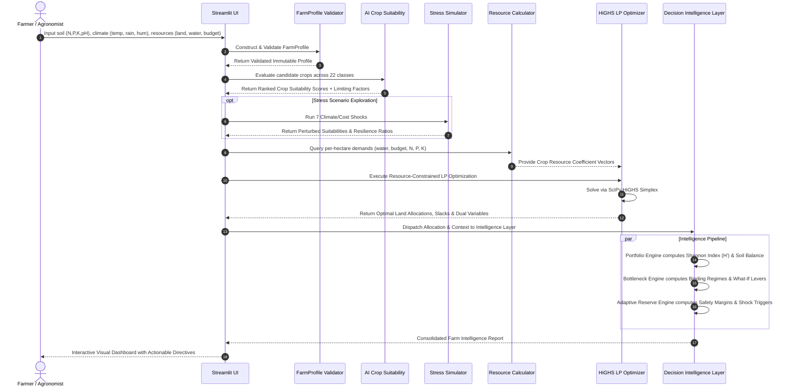

# FarmTwin — End-to-End Data Flow Diagram

This diagram traces the flow and transformations of data throughout the FarmTwin analytical pipeline, from raw user telemetry to actionable decision recommendations.

