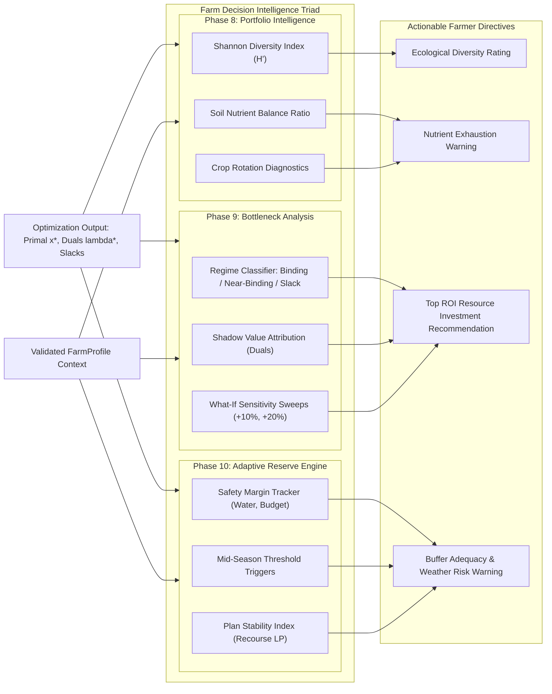

# FarmTwin — Decision Intelligence Pipeline Diagram

This diagram visualizes how raw mathematical optimization outputs are enriched by the three post-optimization decision intelligence engines (Phases 8, 9, and 10).

