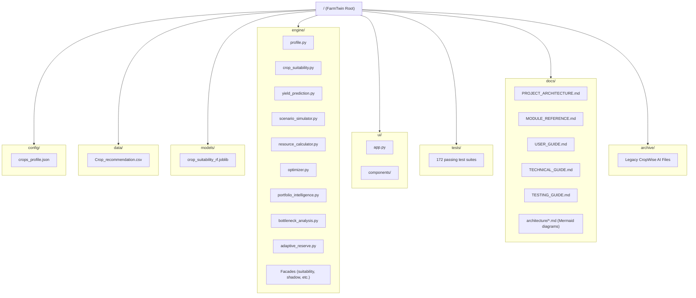

# FarmTwin — Repository Folder Structure

This diagram outlines the complete file and folder hierarchy of the FarmTwin repository.

```mermaid
graph TD
    Root["/ (FarmTwin Root)"]
    
    subgraph ConfigDir ["config/"]
        CropProfile["crops_profile.json"]
    end
    
    subgraph DataDir ["data/"]
        CropCSV["Crop_recommendation.csv"]
    end
    
    subgraph ModelsDir ["models/"]
        RFModel["crop_suitability_rf.joblib"]
    end
    
    subgraph EngineDir ["engine/"]
        E1["profile.py"]
        E2["crop_suitability.py"]
        E3["yield_prediction.py"]
        E4["scenario_simulator.py"]
        E5["resource_calculator.py"]
        E6["optimizer.py"]
        E7["portfolio_intelligence.py"]
        E8["bottleneck_analysis.py"]
        E9["adaptive_reserve.py"]
        Facades["Facades (suitability, shadow, etc.)"]
    end
    
    subgraph UIDir ["ui/"]
        AppPy["app.py"]
        UIComp["components/"]
    end
    
    subgraph TestsDir ["tests/"]
        TestAll["172 passing test suites"]
    end
    
    subgraph DocsDir ["docs/"]
        ArchDoc["PROJECT_ARCHITECTURE.md"]
        ModDoc["MODULE_REFERENCE.md"]
        UserDoc["USER_GUIDE.md"]
        TechDoc["TECHNICAL_GUIDE.md"]
        TestDoc["TESTING_GUIDE.md"]
        ArchDir["architecture/*.md (Mermaid diagrams)"]
    end
    
    subgraph ArchiveDir ["archive/"]
        LegacyCropWise["Legacy CropWise AI Files"]
    end

    Root --> ConfigDir
    Root --> DataDir
    Root --> ModelsDir
    Root --> EngineDir
    Root --> UIDir
    Root --> TestsDir
    Root --> DocsDir
    Root --> ArchiveDir
```
