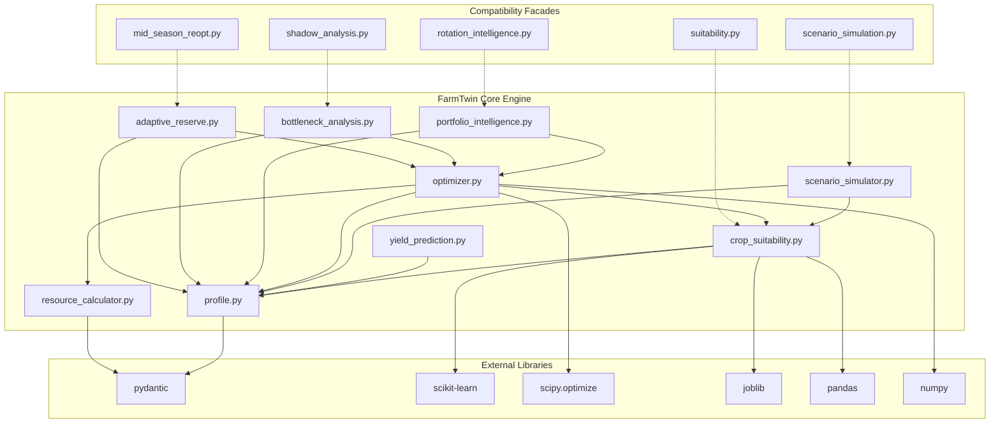

# FarmTwin — Module Dependency Diagram

This diagram displays the inter-module dependency relationships within `engine/` and external library bindings.

```mermaid
graph TD
    subgraph External_Deps ["External Libraries"]
        Pydantic["pydantic"]
        SKLearn["scikit-learn"]
        SciPy["scipy.optimize"]
        Joblib["joblib"]
        Pandas["pandas"]
        Numpy["numpy"]
    end

    subgraph Core_Engine ["FarmTwin Core Engine"]
        Profile["profile.py"]
        Suitability["crop_suitability.py"]
        YieldMod["yield_prediction.py"]
        Simulator["scenario_simulator.py"]
        ResourceCalc["resource_calculator.py"]
        Optimizer["optimizer.py"]
        Portfolio["portfolio_intelligence.py"]
        Bottleneck["bottleneck_analysis.py"]
        Reserve["adaptive_reserve.py"]
    end

    subgraph Facades ["Compatibility Facades"]
        SuitFacade["suitability.py"]
        ScenFacade["scenario_simulation.py"]
        RotFacade["rotation_intelligence.py"]
        ShadFacade["shadow_analysis.py"]
        MidFacade["mid_season_reopt.py"]
    end

    Profile --> Pydantic
    Suitability --> SKLearn
    Suitability --> Joblib
    Suitability --> Pandas
    Suitability --> Profile
    YieldMod --> Profile
    Simulator --> Profile
    Simulator --> Suitability
    ResourceCalc --> Pydantic
    Optimizer --> SciPy
    Optimizer --> Numpy
    Optimizer --> Profile
    Optimizer --> Suitability
    Optimizer --> ResourceCalc
    Portfolio --> Profile
    Portfolio --> Optimizer
    Bottleneck --> Profile
    Bottleneck --> Optimizer
    Reserve --> Profile
    Reserve --> Optimizer

    SuitFacade -.-> Suitability
    ScenFacade -.-> Simulator
    RotFacade -.-> Portfolio
    ShadFacade -.-> Bottleneck
    MidFacade -.-> Reserve
```
