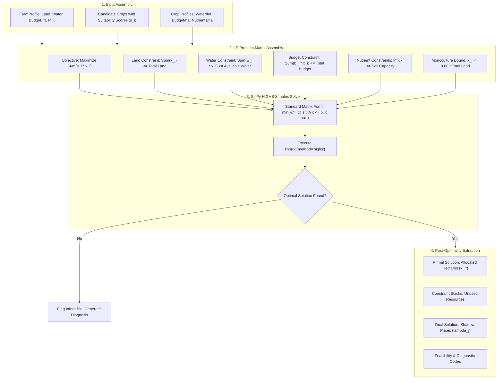

# FarmTwin — Optimization Pipeline Diagram

This diagram details the formulation, matrix assembly, solver execution, and post-optimality analysis of the Linear Programming optimization engine.

```mermaid
flowchart TD
    subgraph Inputs ["1. Input Assembly"]
        FP["FarmProfile: Land, Water, Budget, N, P, K"]
        CC["Candidate Crops with Suitability Scores (s_i)"]
        CP["Crop Profiles: Water/ha, Budget/ha, Nutrients/ha"]
    end

    subgraph Assembly ["2. LP Problem Matrix Assembly"]
        Obj["Objective: Maximize Sum(s_i * x_i)"]
        C1["Land Constraint: Sum(x_i) <= Total Land"]
        C2["Water Constraint: Sum(w_i * x_i) <= Available Water"]
        C3["Budget Constraint: Sum(b_i * x_i) <= Total Budget"]
        C4["Nutrient Constraints: Influx <= Soil Capacity"]
        C5["Monoculture Bound: x_i <= 0.60 * Total Land"]
    end

    subgraph Solver ["3. SciPy HiGHS Simplex Solver"]
        StdForm["Standard Matrix Form: min(-c^T x) s.t. A x <= b, x >= 0"]
        Exec["Execute linprog(method='highs')"]
        ConvergenceCheck{"Optimal Solution Found?"}
    end

    subgraph PostOpt ["4. Post-Optimality Extraction"]
        Primal["Primal Solution: Allocated Hectares (x_i*)"]
        Slacks["Constraint Slacks: Unused Resources"]
        Duals["Dual Solution: Shadow Prices (lambda_j)"]
        FeasFlags["Feasibility & Diagnostic Codes"]
    end

    FP --> Assembly
    CC --> Assembly
    CP --> Assembly

    Obj --> StdForm
    C1 --> StdForm
    C2 --> StdForm
    C3 --> StdForm
    C4 --> StdForm
    C5 --> StdForm

    StdForm --> Exec
    Exec --> ConvergenceCheck
    ConvergenceCheck -- Yes --> PostOpt
    ConvergenceCheck -- No --> InfeasibleReport["Flag Infeasible: Generate Diagnosis"]
```
