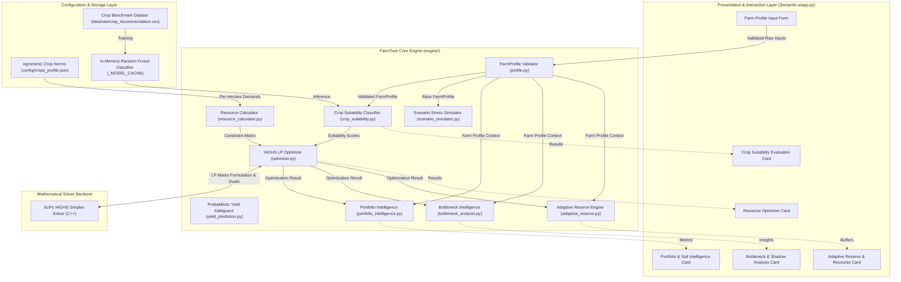

# FarmTwin — System Architecture Diagram

This document illustrates the high-level system architecture of the **FarmTwin — Adaptive Farm Decision Engine**, showing the relationships between UI presentation, analytical engine components, data layers, and solver engines.

